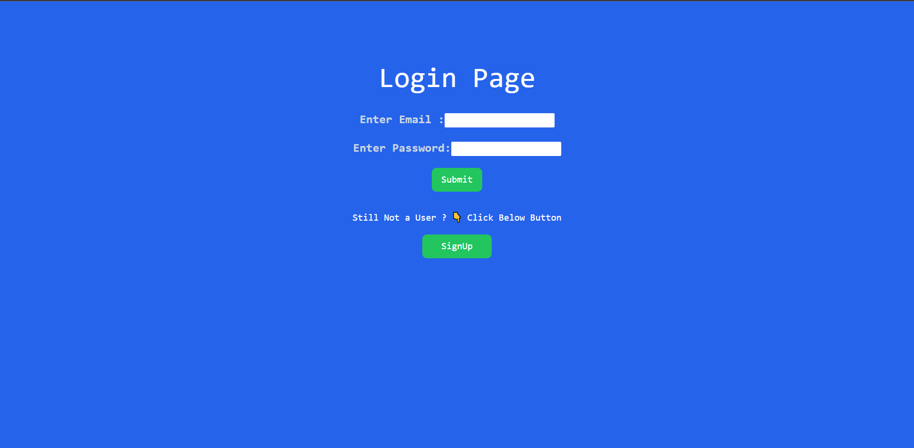
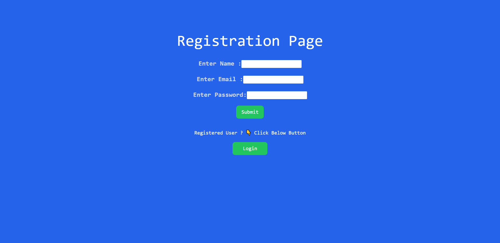
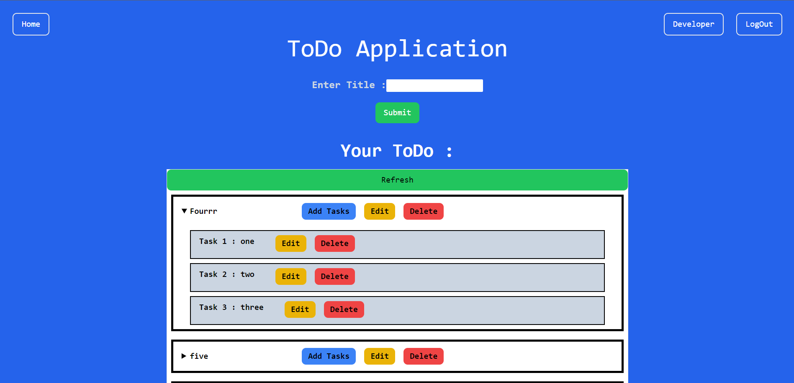

# ToDo Project using MERN

## Murtuza Rangwala

## What I learned from this Project?

### Backend

- I learn about ExpressJs, how to write controllers, and how to make route, giving back response to front-end.

- I learn about Postman and verify my code working or not using Postman.

- I learn how to hide crucial information using dotenv.

- I learn about mongoose from which i connect my MongoDB database.

- I learn some basics of middlewares.

### Front-end

- I learn to think about React JS, how to handle API fetch using Axios work with them.

- I learn to integrate Appwrite and create a authentication using it.

- I learn how to and where to use Hooks and also learn about JSX.

- This project took around 4 hours to complete.

## Live Link of the Project:

[Live Project Link will be added soon.]()

## Output:

**ToDo-Login**

**ToDo-SignUp**

**ToDo-Dashboard**

